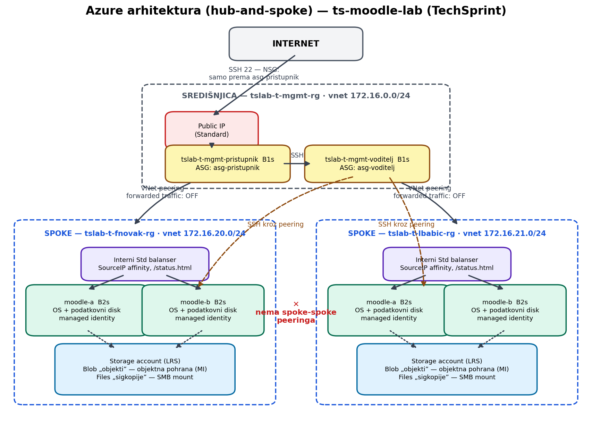
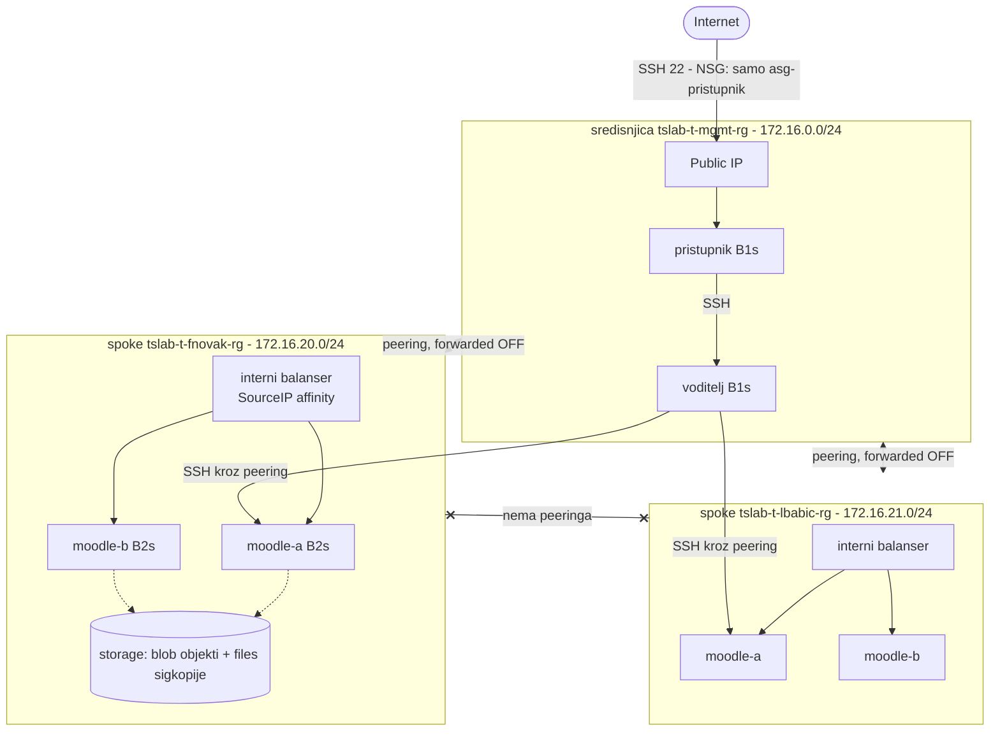

# Azure arhitektura (hub-and-spoke)

## Kljucne odluke

* **Hub-and-spoke**: spoke VNet-ovi peerani su iskljucivo na sredisnjicu;
  `allow_forwarded_traffic=false` + nepostojanje spoke-spoke peeringa znaci da
  promet izmedju programera nije moguc (peering nije tranzitivan).
* **Javna izlozenost**: Public IP postoji samo na pristupniku; NSG pravilo
  `Dozvoli-Internet-SSH-SamoPristupnik` cilja ASG, ne IP adrese.
* **Pohrana**: po programeru jedan storage account — blob spremnik `objekti`
  (pristup managed identityjem + rola samo na tom accountu) i file share
  `sigkopije` (SMB mount, mrezno ogranicen service endpointom).
* **Balanser**: interni Standard LB s `load_distribution = SourceIP`
  (session affinity za Moodle) i probeom na `/status.html`.
