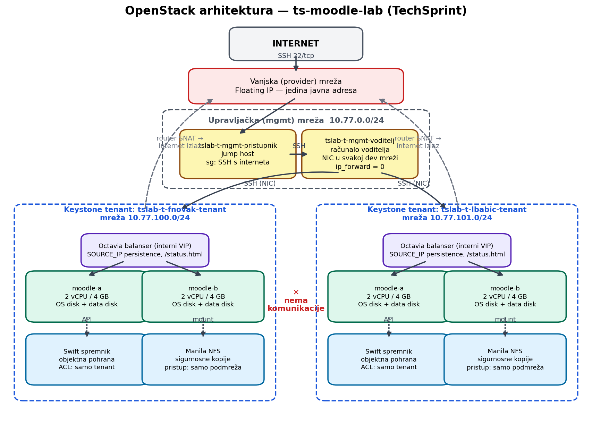
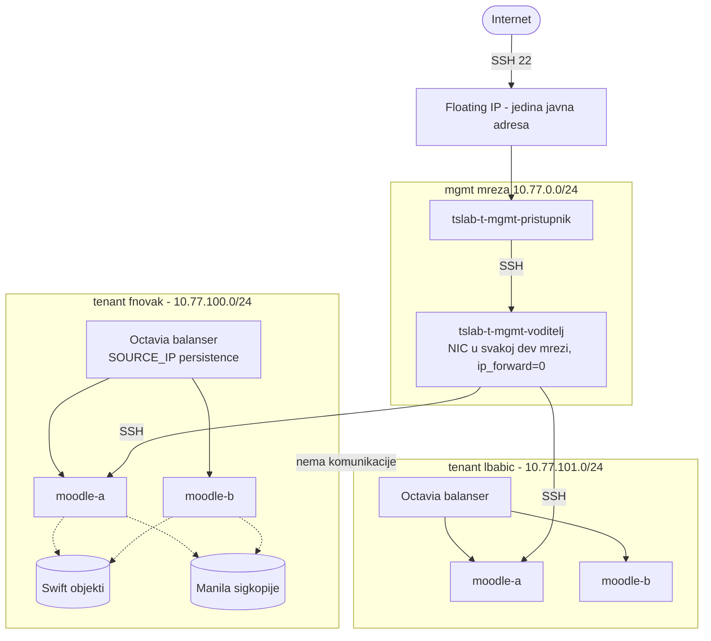

# OpenStack arhitektura

Mermaid izvor (GitHub ga renderira):

## Kljucne odluke

* **Izolacija**: svaki programer ima vlastiti Keystone tenant, mrezu, podmrezu i
  usmjernik; medju mrezama programera ne postoji ruta. Voditeljevo racunalo ima NIC
  u svakoj mrezi, ali s iskljucenim IP forwardingom pa nije tranzitna tocka.
* **Izlaz na internet**: usmjernik svakog programera radi SNAT na vanjsku mrezu —
  instance povlace pakete bez javnih adresa.
* **Visoka dostupnost**: dvije Moodle instance (moodle-a, moodle-b) iza internog
  Octavia balansera; ROUND_ROBIN + **SOURCE_IP session persistence** (Moodle drzi
  PHP sesiju lokalno pa isti klijent mora ici na istu instancu) i HTTP nadzor na
  `/status.html`.
* **Dva diska po instanci**: OS disk iz Rocky 9 slike + podatkovni Cinder disk
  (XFS, automatski montiran na `/opt/moodle-podaci`).
