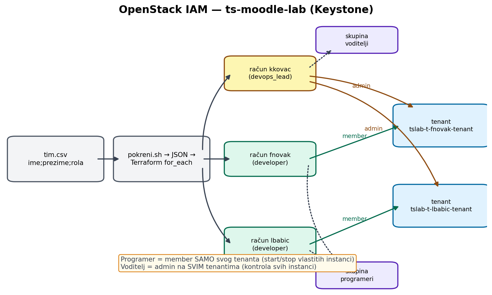
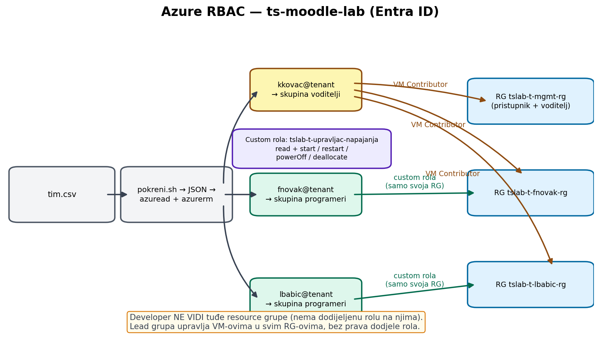

# IAM modeli

## OpenStack (Keystone)

* CSV (`tim.csv`) → `pokreni.sh` pretvara u JSON → Terraform `for_each` kreira
  Keystone racune, skupine (`programeri`, `voditelji`) i tenant po programeru.
* **Programer** = rola `member` iskljucivo na svom tenantu → vidi i upravlja samo
  svojim resursima, ukljucujuci start/stop/reboot vlastitih instanci.
* **Voditelj** = rola `admin` na svim tenantima programera → pali/gasi sve
  instance; fizicki pristup SSH-om s racunala `tslab-t-mgmt-voditelj`.
* Pocetne lozinke generira `random_password` (sensitive output `pocetne_lozinke`).

## Azure (Entra ID + RBAC)

* Iz CSV-a nastaju Entra racuni (`fnovak@...`, uz obveznu promjenu lozinke) i
  sigurnosne skupine `tslab-t-skupina-programeri` / `tslab-t-skupina-voditelji`.
* Custom rola **`tslab-t-upravljac-napajanja`**: read + `start` / `restart` /
  `powerOff` / `deallocate` — nista drugo. Dodjeljuje se programeru **samo na
  njegovoj resource grupi**; tudje grupe ne vidi jer na njima nema nikakvu rolu.
* Skupina voditelja: ugradjena rola **Virtual Machine Contributor** na svim
  resource grupama (programeri + sredisnjica) — kontrola svih VM-ova, bez prava
  dodjele rola.
